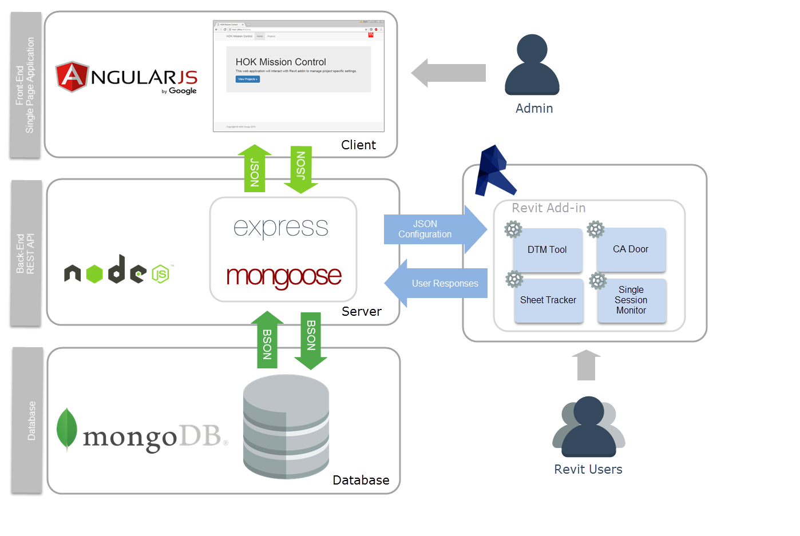

# MissionControl
This web application will allow for users to control modeling behaviors following project standard in Revit. Based upon the settings stored in mongoDB by the web UI, the Revit Addin tool will activate or deactivate certain toolsets. 

# Setup

Please add two Environmental Variables to your system that MC will be looking for:

`DB_HOST=<your url to mongo db>`
`MC_PORT=<your port>`

You can do that easily taking advantage of the `dotenv` package installed. Drop a `.env` file into the root of this project with the above variables in it, and `dotenv` will take care of the rest. 
